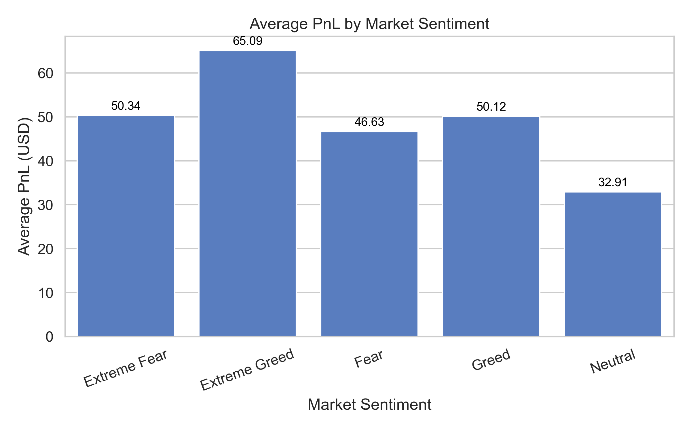

## Data Sources
- Trader Data: Trade details including PnL, fees, direction, and execution prices.
- Sentiment Data: Daily sentiment classification from historical market data.
- Merged Data: Timestamp alignment ensures each trade is matched to the prevailing sentiment.

## Visual Insights

### 1️.Trades Count by Sentiment

### 2️.Average PnL by Sentiment

### 3️.Average PnL: Profitable vs Not

### 4️. PnL Distribution: Fear vs Greed

## Statistical Analysis
Mann–Whitney U Test between `Fear` and `Greed` PnL:
- N Fear trades: 82,813
- N Greed trades: 88,848
- p-value: 0.0016 → Statistically significant difference.

## Hidden Trends & Signals
1. Sentiment–Profitability Mismatch
   - Extreme Greed: Small positions, high win rate — opportunity to scale up.
   - Fear: Large positions, lower returns — risk of overexposure.

2. Risk Profile Changes
   - Greed: Higher downside tail losses → tighten stop-loss.
   - Extreme Fear: Steady returns possible with defensive strategies.

3. Neutral Periods Weak
   - Lowest returns and win rate — reduce activity.

4. Behavioral Bias
   - Traders size up in Fear but reduce in Greed — opposite of optimal risk sizing.

##  Sentiment Trading Playbook

| Sentiment       | Trade Size         | Stop-Loss Distance | Frequency | Notes |
|-----------------|--------------------|--------------------|-----------|-------|
| Extreme Greed   | ↑ Increase 10–15%  | Tight              | Moderate  | High win rate, low avg size → scale up |
| Greed           | Normal             | Tighter than usual | Moderate  | Watch for large downside tails |
| Neutral         | ↓ Reduce 20–30%    | Normal             | Low       | Weakest performance → avoid overtrading |
| Fear            | ↓ Reduce 20–30%    | Normal/Tight       | High      | Large positions in data but lower returns |
| Extreme Fear    | Normal             | Normal             | Moderate  | Decent PnL with defensive approach |

## Strategic Recommendations
- Increase position size in Extreme Greed periods with strong risk management.
- Reduce exposure in Fear to avoid capital drawdowns.
- Avoid Neutral markets — low reward environment.
- Tighten stop-loss in Greed phases to prevent large losses.
- Use sentiment classification as a filter in all trading decisions.

